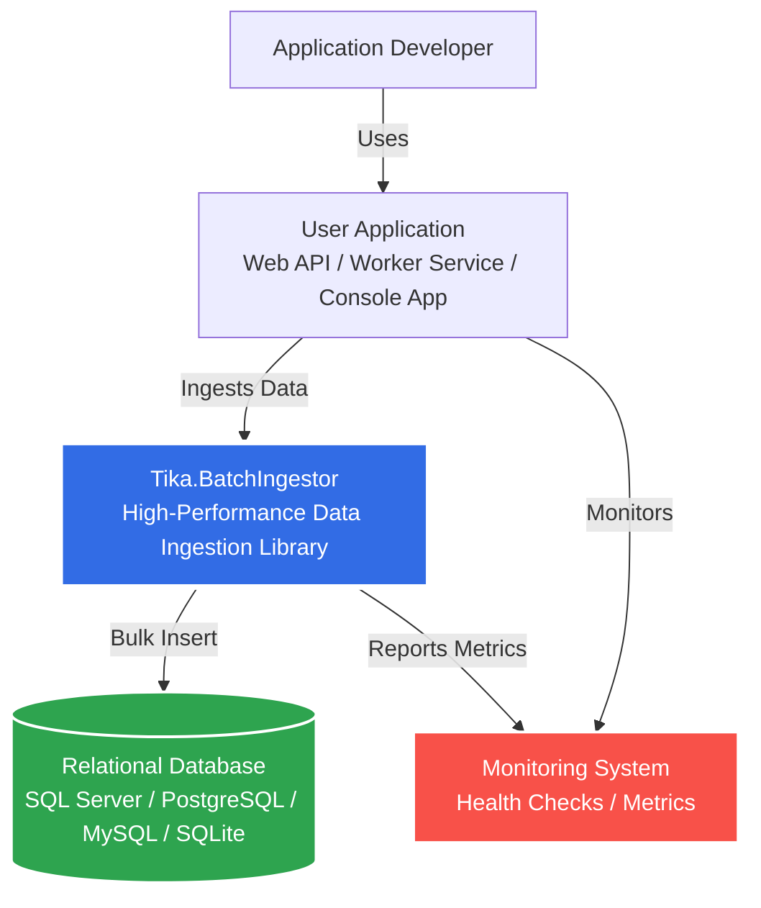
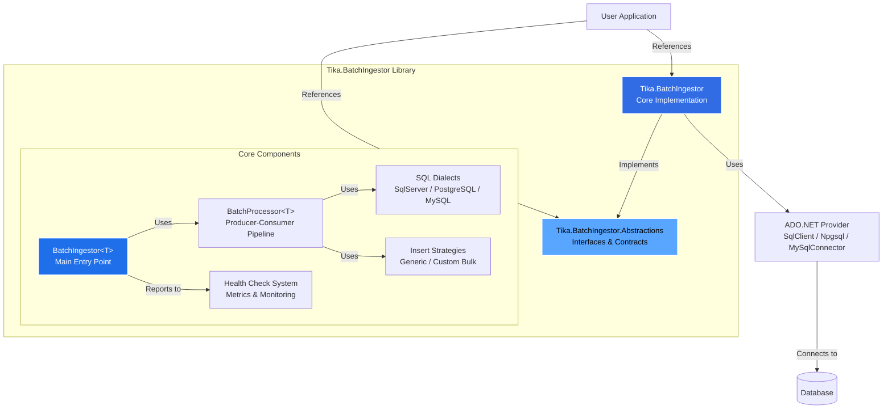
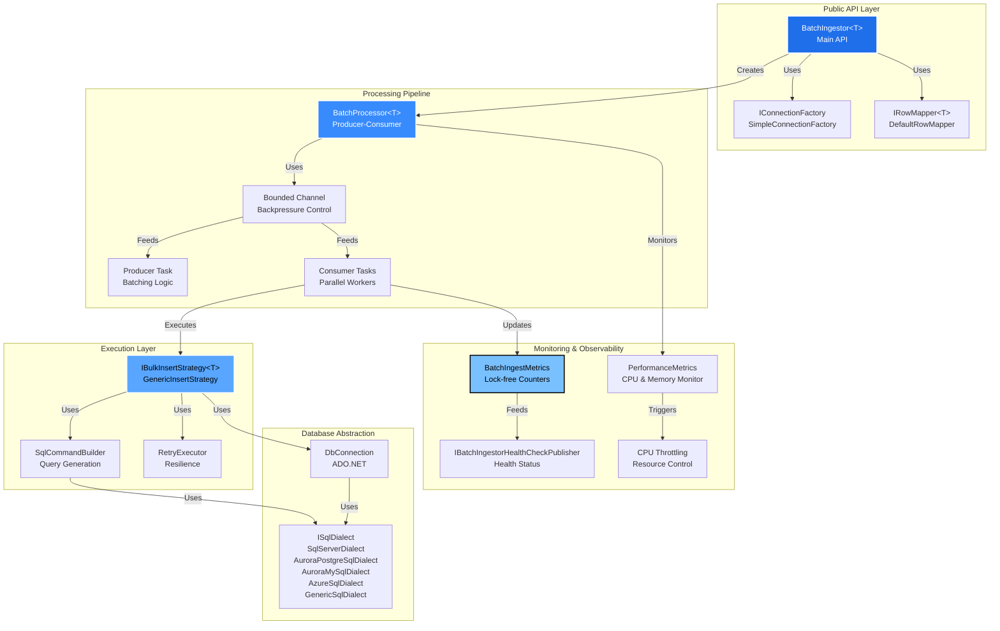
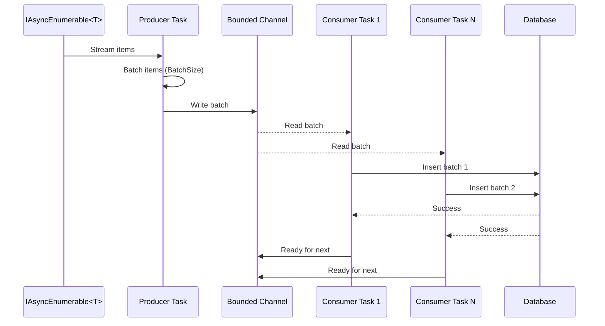
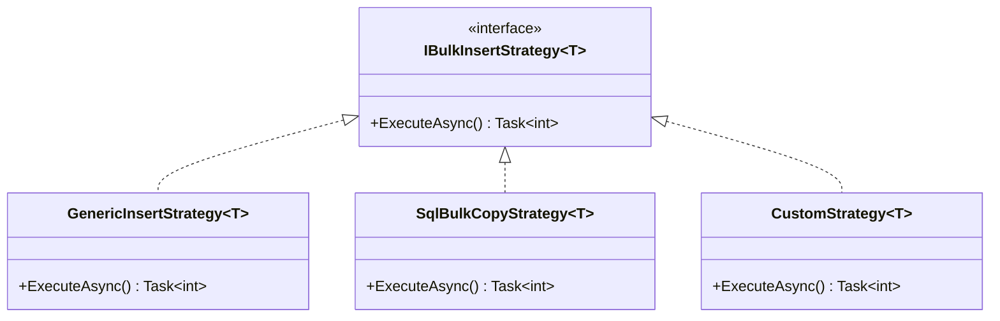
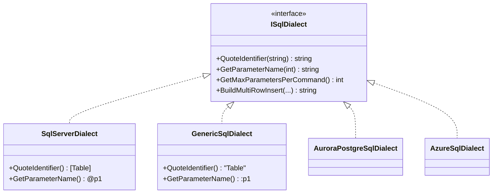
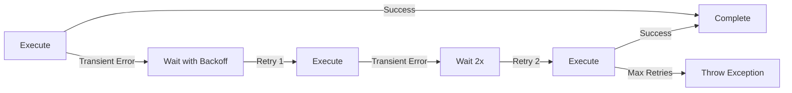
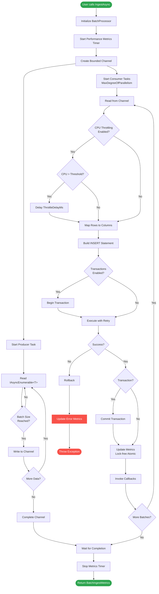

# Architecture Overview

This document describes the architecture of Tika.BatchIngestor using the C4 model (Context, Containers, Components, and Code).

## Table of Contents

- [Overview](#overview)
- [Level 1: System Context](#level-1-system-context)
- [Level 2: Container Diagram](#level-2-container-diagram)
- [Level 3: Component Diagram](#level-3-component-diagram)
- [Key Architectural Patterns](#key-architectural-patterns)
- [Data Flow](#data-flow)
- [Concurrency Model](#concurrency-model)
- [Performance Optimizations](#performance-optimizations)

## Overview

Tika.BatchIngestor is a high-performance .NET library designed for efficient bulk data ingestion into relational databases. It uses a producer-consumer pattern with bounded channels to manage backpressure and resource utilization.

### Design Principles

1. **RDBMS Agnostic**: Works with any ADO.NET provider
2. **Performance First**: Lock-free operations, zero-allocation patterns
3. **Resource Control**: CPU throttling, memory management, concurrency limits
4. **Observable**: Comprehensive metrics and health checks
5. **Extensible**: Plugin architecture for dialects and strategies

## Level 1: System Context

The System Context diagram shows how Tika.BatchIngestor fits into the overall system landscape.



### System Context Description

- **Application Developer**: Creates applications that need to ingest large volumes of data into databases
- **User Application**: Any .NET application (Web API, Worker Service, Console App) that processes and stores data
- **Tika.BatchIngestor**: The core library that handles efficient batch data ingestion
- **Relational Database**: Target database system (SQL Server, PostgreSQL, MySQL, SQLite, etc.)
- **Monitoring System**: ASP.NET Core Health Checks or custom monitoring solutions

## Level 2: Container Diagram

The Container diagram shows the high-level technical building blocks and their relationships.



### Container Responsibilities

#### Tika.BatchIngestor.Abstractions
- Defines interfaces and contracts (`IBatchIngestor<T>`, `ISqlDialect`, `IBulkInsertStrategy<T>`)
- Contains configuration models (`BatchIngestOptions`, `RetryPolicy`)
- Defines metrics and monitoring types (`BatchIngestMetrics`, `PerformanceMetrics`)
- Provides exception types (`BatchIngestException`)

#### Tika.BatchIngestor (Core)
- Implements all abstractions
- Provides concrete implementations of SQL dialects
- Includes built-in bulk insert strategies
- Contains internal processing pipeline
- Implements health check system

## Level 3: Component Diagram

The Component diagram shows the internal structure of the core library.



### Component Descriptions

#### Public API Layer

**BatchIngestor&lt;T&gt;** (`src/Tika.BatchIngestor/BatchIngestor.cs:14`)
- Main entry point for users
- Validates configuration
- Orchestrates the ingestion process
- Returns comprehensive metrics

**IRowMapper&lt;T&gt; / DefaultRowMapper** (`src/Tika.BatchIngestor/DefaultRowMapper.cs`)
- Maps domain objects to database columns
- Supports custom mapping logic via delegates

**IConnectionFactory / SimpleConnectionFactory** (`src/Tika.BatchIngestor/Factories/SimpleConnectionFactory.cs`)
- Abstracts database connection creation
- Supports connection string management
- Enables connection pooling

#### Processing Pipeline

**BatchProcessor&lt;T&gt;** (`src/Tika.BatchIngestor/Internal/BatchProcessor.cs:9`)
- Implements producer-consumer pattern
- Manages bounded channels for backpressure
- Coordinates parallel batch processing
- Handles CPU throttling and monitoring

**Bounded Channel**
- System.Threading.Channels-based queue
- Configurable capacity (`MaxInFlightBatches`)
- Controls memory usage
- Provides backpressure when full

**Producer Task**
- Reads input data stream (`IAsyncEnumerable<T>`)
- Groups items into batches of configurable size
- Writes batches to channel
- Single-writer optimization

**Consumer Tasks**
- Parallel workers (configurable via `MaxDegreeOfParallelism`)
- Read batches from channel
- Execute insert strategy
- Multiple-reader support

#### Execution Layer

**IBulkInsertStrategy&lt;T&gt;** (`src/Tika.BatchIngestor/Strategies/GenericInsertStrategy.cs`)
- Executes the actual database insert
- Generic strategy: multi-row INSERT statements
- Extensible: custom strategies (e.g., SqlBulkCopy adapter)
- Handles transactions

**SqlCommandBuilder** (`src/Tika.BatchIngestor/Internal/SqlCommandBuilder.cs`)
- Generates parameterized SQL INSERT statements
- Optimizes multi-row inserts
- Prevents SQL injection
- Dialect-aware query generation

**RetryExecutor** (`src/Tika.BatchIngestor/Internal/RetryExecutor.cs`)
- Implements retry logic with exponential backoff
- Handles transient failures
- Configurable retry policies
- Includes jitter to prevent thundering herd

#### Database Abstraction

**ISqlDialect** (`src/Tika.BatchIngestor.Abstractions/ISqlDialect.cs`)
- Abstracts database-specific SQL syntax
- Identifier quoting (e.g., `[Table]` vs `"Table"`)
- Parameter naming (`@p1` vs `:p1`)
- Max parameters per command
- Multi-row INSERT syntax

**Implementations:**
- `SqlServerDialect`: SQL Server / Azure SQL
- `AuroraPostgreSqlDialect`: Amazon Aurora PostgreSQL
- `AuroraMySqlDialect`: Amazon Aurora MySQL
- `AzureSqlDialect`: Azure SQL with optimizations
- `GenericSqlDialect`: Fallback for any database

#### Monitoring & Observability

**BatchIngestMetrics** (`src/Tika.BatchIngestor.Abstractions/BatchIngestMetrics.cs`)
- Lock-free atomic counters using `Interlocked`
- Tracks rows processed, batches completed, errors
- Calculates throughput (rows/sec)
- Provides snapshots for reporting

**PerformanceMetrics** (`src/Tika.BatchIngestor.Abstractions/PerformanceMetrics.cs`)
- Real-time CPU usage monitoring
- Memory usage (working set, private bytes)
- GC collection counts (Gen0, Gen1, Gen2)
- Thread count tracking
- Peak metrics capture

**IBatchIngestorHealthCheckPublisher** (`src/Tika.BatchIngestor/HealthChecks/BatchIngestorHealthCheckPublisher.cs:8`)
- ASP.NET Core Health Checks integration
- Determines health status (Healthy, Degraded, Unhealthy)
- Provides detailed diagnostic data
- Error rate calculation

**CPU Throttling** (`src/Tika.BatchIngestor/Internal/BatchProcessor.cs:144`)
- Monitors CPU usage in real-time
- Delays processing when threshold exceeded
- Prevents resource exhaustion
- Configurable via `MaxCpuPercent`

## Key Architectural Patterns

### 1. Producer-Consumer Pattern



### 2. Bounded Channel for Backpressure

The library uses `System.Threading.Channels` with bounded capacity to control memory usage:

```csharp
// Bounded channel configuration
var channel = Channel.CreateBounded<List<T>>(
    new BoundedChannelOptions(MaxInFlightBatches)
    {
        FullMode = BoundedChannelFullMode.Wait,  // Backpressure
        SingleReader = false,                     // Multiple consumers
        SingleWriter = true                       // Single producer
    });
```

**Benefits:**
- Prevents unbounded memory growth
- Natural backpressure when channel is full
- Producer automatically waits when limit reached
- Memory usage = `MaxInFlightBatches × BatchSize × AvgRowSize`

### 3. Strategy Pattern for Extensibility



Users can provide custom strategies for database-specific optimizations (e.g., SqlBulkCopy, PostgreSQL COPY).

### 4. Adapter Pattern for SQL Dialects



### 5. Retry Pattern with Exponential Backoff

The library implements resilient database operations with configurable retry policies:



## Data Flow

### Complete Ingestion Flow



## Concurrency Model

### Thread Safety Guarantees

1. **Lock-Free Metrics**: Uses `Interlocked` operations for counter updates
2. **Channel-Based Communication**: Thread-safe by design
3. **Immutable Configuration**: `BatchIngestOptions` validated at construction
4. **Connection Per Batch**: No shared database connections
5. **Snapshot Isolation**: Metrics snapshots for callbacks

### Parallelism Configuration

```
MaxDegreeOfParallelism = Number of concurrent consumer tasks
MaxInFlightBatches = Channel capacity (backpressure control)

Optimal Configuration:
- CPU-bound: MaxDOP ≈ ProcessorCount
- IO-bound: MaxDOP ≈ 2-4× ProcessorCount
- Memory: MaxInFlightBatches × BatchSize × RowSize < Available Memory
```

### Task Lifecycle

```mermaid
gantt
    title Concurrent Task Execution
    dateFormat X
    axisFormat %L

    section Producer
    Read & Batch Data: p1, 0, 1000
    Write to Channel: p2, after p1, 100

    section Consumer 1
    Read Batch 1: c1, 50, 200
    Process Batch 1: c2, after c1, 300
    Read Batch 2: c3, after c2, 200

    section Consumer 2
    Read Batch 1: c4, 100, 200
    Process Batch 1: c5, after c4, 300
    Read Batch 2: c6, after c5, 200

    section Consumer N
    Read Batch 1: c7, 150, 200
    Process Batch 1: c8, after c7, 300
```



## Performance Optimizations

### 1. Lock-Free Atomic Operations

```csharp
// No locks, no contention
private long _totalRowsProcessed;

public void AddRowsProcessed(int count)
{
    Interlocked.Add(ref _totalRowsProcessed, count);
}
```

### 2. Zero-Allocation Patterns

- Pre-allocated batch lists with capacity
- Struct-based segments to avoid allocations
- Reused string builders for SQL generation

### 3. Optimized Task.Yield

```csharp
// Periodic yielding instead of per-item
if (++count % batchSize == 0)
{
    await Task.Yield();
}
```

### 4. Bounded Channels for Memory Control

- Fixed memory footprint
- No unbounded queues
- Automatic backpressure

### 5. CPU Throttling

- Real-time CPU monitoring
- Automatic delay injection when threshold exceeded
- Prevents resource starvation

### 6. Multi-Row Inserts

Instead of:
```sql
INSERT INTO Table (A, B) VALUES (1, 2);
INSERT INTO Table (A, B) VALUES (3, 4);
```

Uses:
```sql
INSERT INTO Table (A, B) VALUES (1, 2), (3, 4);
```

This reduces network round trips and database overhead.

## Technology Stack

- **Language**: C# 10 / .NET 6+
- **Async**: async/await, IAsyncEnumerable&lt;T&gt;
- **Concurrency**: System.Threading.Channels
- **Database**: ADO.NET (DbConnection, DbCommand, DbTransaction)
- **Metrics**: System.Diagnostics (Process, Stopwatch)
- **Logging**: Microsoft.Extensions.Logging
- **Health Checks**: Microsoft.Extensions.Diagnostics.HealthChecks (optional)

## Extension Points

1. **Custom SQL Dialect**: Implement `ISqlDialect` for database-specific syntax
2. **Custom Bulk Strategy**: Implement `IBulkInsertStrategy<T>` for optimized bulk operations
3. **Custom Connection Factory**: Implement `IConnectionFactory` for advanced connection management
4. **Custom Row Mapper**: Implement `IRowMapper<T>` for complex mapping scenarios
5. **Health Check Integration**: Implement `IBatchIngestorHealthCheckPublisher` for custom monitoring

## References

- [C4 Model](https://c4model.com/) - Software architecture diagramming
- [System.Threading.Channels](https://devblogs.microsoft.com/dotnet/an-introduction-to-system-threading-channels/) - Channel-based concurrency
- [ADO.NET](https://docs.microsoft.com/en-us/dotnet/framework/data/adonet/) - Data access technology
- [ASP.NET Core Health Checks](https://docs.microsoft.com/en-us/aspnet/core/host-and-deploy/health-checks) - Application monitoring
