# Health Check Integration

This guide covers implementing and using health checks with Tika.BatchIngestor for production monitoring and observability.

## Table of Contents

- [Overview](#overview)
- [ASP.NET Core Health Checks Integration](#aspnet-core-health-checks-integration)
- [Manual Health Checks](#manual-health-checks)
- [Health Status Determination](#health-status-determination)
- [Monitoring Endpoints](#monitoring-endpoints)
- [Cloud Platform Integration](#cloud-platform-integration)
- [Alerting and Notifications](#alerting-and-notifications)
- [Custom Health Checks](#custom-health-checks)
- [Best Practices](#best-practices)

## Overview

Tika.BatchIngestor provides built-in health check support through the `IBatchIngestorHealthCheckPublisher` interface, which integrates seamlessly with ASP.NET Core Health Checks.

### Health Status Levels

- **Healthy**: System operating normally
- **Degraded**: System operational but with issues (high CPU, moderate errors)
- **Unhealthy**: System experiencing critical issues (high error rate, system failures)

### Key Metrics Monitored

- Throughput (rows per second)
- Error rate
- CPU usage
- Memory usage
- Batch completion rate

## ASP.NET Core Health Checks Integration

### Basic Setup

#### 1. Install Required Packages

```bash
dotnet add package Microsoft.Extensions.Diagnostics.HealthChecks
dotnet add package AspNetCore.HealthChecks.UI.Client  # Optional: for rich JSON output
```

#### 2. Configure Services

```csharp
using Microsoft.Extensions.DependencyInjection;
using Tika.BatchIngestor;
using Tika.BatchIngestor.Abstractions;
using Tika.BatchIngestor.HealthChecks;

public class Startup
{
    public void ConfigureServices(IServiceCollection services)
    {
        // Register BatchIngestor dependencies
        services.AddSingleton<IConnectionFactory>(sp =>
            new SimpleConnectionFactory(
                Configuration.GetConnectionString("Database"),
                () => new NpgsqlConnection(Configuration.GetConnectionString("Database"))
            ));

        services.AddSingleton<ISqlDialect, AuroraPostgreSqlDialect>();

        services.AddSingleton<IRowMapper<MyData>, MyDataMapper>();

        services.AddSingleton(sp =>
            new BatchIngestOptions
            {
                BatchSize = 5000,
                MaxDegreeOfParallelism = 6,
                MaxInFlightBatches = 15,
                EnableCpuThrottling = true,
                MaxCpuPercent = 80.0,
                EnablePerformanceMetrics = true
            });

        services.AddSingleton<IBatchIngestor<MyData>, BatchIngestor<MyData>>();

        // Register shared metrics instances
        services.AddSingleton<BatchIngestMetrics>();
        services.AddSingleton<PerformanceMetrics>();

        // Register health check publisher
        services.AddSingleton<IBatchIngestorHealthCheckPublisher, BatchIngestorHealthCheckPublisher>();

        // Add health checks
        services.AddHealthChecks()
            .AddBatchIngestorHealthCheck("batch-ingestor")
            .AddNpgSql(
                Configuration.GetConnectionString("Database"),
                name: "database",
                tags: new[] { "db", "postgres" })
            .AddCheck("self", () => HealthCheckResult.Healthy(), tags: new[] { "self" });
    }

    public void Configure(IApplicationBuilder app)
    {
        // Health check endpoints
        app.UseHealthChecks("/health", new HealthCheckOptions
        {
            Predicate = _ => true,
            ResponseWriter = UIResponseWriter.WriteHealthCheckUIResponse
        });

        app.UseHealthChecks("/health/ready", new HealthCheckOptions
        {
            Predicate = check => check.Tags.Contains("ready"),
            ResponseWriter = UIResponseWriter.WriteHealthCheckUIResponse
        });

        app.UseHealthChecks("/health/live", new HealthCheckOptions
        {
            Predicate = check => check.Tags.Contains("live") || check.Name == "self",
            ResponseWriter = UIResponseWriter.WriteHealthCheckUIResponse
        });

        app.UseRouting();
        app.UseEndpoints(endpoints =>
        {
            endpoints.MapControllers();
            endpoints.MapHealthChecks("/health");
        });
    }
}
```

### Extension Method for Easy Registration

```csharp
using Microsoft.Extensions.DependencyInjection;
using Microsoft.Extensions.Diagnostics.HealthChecks;

public static class BatchIngestorHealthCheckExtensions
{
    public static IHealthChecksBuilder AddBatchIngestorHealthCheck(
        this IHealthChecksBuilder builder,
        string name = "batch-ingestor",
        HealthStatus? failureStatus = null,
        IEnumerable<string>? tags = null,
        TimeSpan? timeout = null)
    {
        return builder.Add(new HealthCheckRegistration(
            name,
            sp => new BatchIngestorHealthCheck(
                sp.GetRequiredService<IBatchIngestorHealthCheckPublisher>()),
            failureStatus,
            tags,
            timeout));
    }
}

// Implementation
public class BatchIngestorHealthCheck : IHealthCheck
{
    private readonly IBatchIngestorHealthCheckPublisher _publisher;

    public BatchIngestorHealthCheck(IBatchIngestorHealthCheckPublisher publisher)
    {
        _publisher = publisher;
    }

    public Task<HealthCheckResult> CheckHealthAsync(
        HealthCheckContext context,
        CancellationToken cancellationToken = default)
    {
        var result = _publisher.GetHealthCheckResult();

        var healthCheckResult = result.Status switch
        {
            HealthStatus.Healthy => HealthCheckResult.Healthy(
                result.Description,
                result.Data),
            HealthStatus.Degraded => HealthCheckResult.Degraded(
                result.Description,
                data: result.Data),
            HealthStatus.Unhealthy => HealthCheckResult.Unhealthy(
                result.Description,
                data: result.Data),
            _ => HealthCheckResult.Unhealthy("Unknown health status")
        };

        return Task.FromResult(healthCheckResult);
    }
}
```

### Health Check Response Example

**Request:**
```bash
curl -X GET https://api.example.com/health
```

**Response (Healthy):**
```json
{
  "status": "Healthy",
  "totalDuration": "00:00:00.0123456",
  "entries": {
    "batch-ingestor": {
      "status": "Healthy",
      "description": "Operating normally. Throughput: 8,432 rows/sec, CPU: 45.23%",
      "duration": "00:00:00.0045678",
      "data": {
        "TotalRowsProcessed": 1000000,
        "BatchesCompleted": 1000,
        "ErrorCount": 0,
        "ErrorRate": 0.0,
        "RowsPerSecond": 8432.5,
        "AverageBatchDuration": "00:00:00.1186667",
        "CpuUsagePercent": 45.23,
        "MemoryMB": 256.8,
        "PeakMemoryMB": 312.4,
        "Gen0Collections": 45,
        "Gen1Collections": 12,
        "Gen2Collections": 3,
        "ThreadCount": 18
      }
    },
    "database": {
      "status": "Healthy",
      "description": "Database connection successful",
      "duration": "00:00:00.0234567"
    },
    "self": {
      "status": "Healthy",
      "description": "Application is running",
      "duration": "00:00:00.0001234"
    }
  }
}
```

**Response (Degraded):**
```json
{
  "status": "Degraded",
  "totalDuration": "00:00:00.0156789",
  "entries": {
    "batch-ingestor": {
      "status": "Degraded",
      "description": "CPU usage (85.67%) exceeds threshold (80.00%)",
      "duration": "00:00:00.0045678",
      "data": {
        "TotalRowsProcessed": 500000,
        "BatchesCompleted": 500,
        "ErrorCount": 5,
        "ErrorRate": 0.01,
        "RowsPerSecond": 7234.2,
        "CpuUsagePercent": 85.67,
        "MemoryMB": 412.3
      }
    }
  }
}
```

**Response (Unhealthy):**
```json
{
  "status": "Unhealthy",
  "totalDuration": "00:00:00.0178912",
  "entries": {
    "batch-ingestor": {
      "status": "Unhealthy",
      "description": "High error rate: 55.00% (55 errors in 100 batches)",
      "duration": "00:00:00.0067890",
      "data": {
        "TotalRowsProcessed": 45000,
        "BatchesCompleted": 100,
        "ErrorCount": 55,
        "ErrorRate": 0.55,
        "RowsPerSecond": 1234.5
      }
    }
  }
}
```

## Manual Health Checks

For scenarios without ASP.NET Core or when you need manual control:

### Basic Manual Check

```csharp
using Tika.BatchIngestor.Abstractions;
using Tika.BatchIngestor.HealthChecks;

// Create metrics instances
var metrics = new BatchIngestMetrics();
var performanceMetrics = new PerformanceMetrics();

// Configure options
var options = new BatchIngestOptions
{
    MaxCpuPercent = 80.0,
    EnableCpuThrottling = true,
    EnablePerformanceMetrics = true
};

// Create health check publisher
var healthCheckPublisher = new BatchIngestorHealthCheckPublisher(
    metrics,
    performanceMetrics,
    options
);

// Check health periodically
while (true)
{
    var healthResult = healthCheckPublisher.GetHealthCheckResult();

    Console.WriteLine($"Status: {healthResult.Status}");
    Console.WriteLine($"Description: {healthResult.Description}");
    Console.WriteLine($"Throughput: {healthResult.Metrics.RowsPerSecond:N0} rows/sec");

    if (healthResult.Performance != null)
    {
        Console.WriteLine($"CPU: {healthResult.Performance.CpuUsagePercent:F2}%");
        Console.WriteLine($"Memory: {healthResult.Performance.WorkingSetMB:F2} MB");
    }

    if (healthResult.Status == HealthStatus.Unhealthy)
    {
        Console.WriteLine("⚠️ System is unhealthy! Taking corrective action...");
        // Take action: alert ops, reduce load, etc.
    }

    await Task.Delay(TimeSpan.FromSeconds(10));
}
```

### Integration with Custom Monitoring

```csharp
public class BatchIngestorMonitor
{
    private readonly IBatchIngestorHealthCheckPublisher _healthCheckPublisher;
    private readonly ILogger<BatchIngestorMonitor> _logger;
    private readonly IMetricsCollector _metricsCollector;
    private readonly IAlertService _alertService;
    private Timer? _timer;

    public BatchIngestorMonitor(
        IBatchIngestorHealthCheckPublisher healthCheckPublisher,
        ILogger<BatchIngestorMonitor> logger,
        IMetricsCollector metricsCollector,
        IAlertService alertService)
    {
        _healthCheckPublisher = healthCheckPublisher;
        _logger = logger;
        _metricsCollector = metricsCollector;
        _alertService = alertService;
    }

    public void Start()
    {
        _timer = new Timer(CheckHealth, null, TimeSpan.Zero, TimeSpan.FromSeconds(30));
    }

    private void CheckHealth(object? state)
    {
        try
        {
            var result = _healthCheckPublisher.GetHealthCheckResult();

            // Log health status
            _logger.LogInformation(
                "Health check: Status={Status}, Throughput={Throughput}, CPU={Cpu}%",
                result.Status,
                result.Metrics.RowsPerSecond,
                result.Performance?.CpuUsagePercent);

            // Export metrics
            _metricsCollector.RecordGauge("batch_ingestor.health_status",
                result.Status == HealthStatus.Healthy ? 1 :
                result.Status == HealthStatus.Degraded ? 0.5 : 0);

            _metricsCollector.RecordGauge("batch_ingestor.rows_per_second",
                result.Metrics.RowsPerSecond);

            _metricsCollector.RecordCounter("batch_ingestor.rows_processed",
                result.Metrics.TotalRowsProcessed);

            _metricsCollector.RecordCounter("batch_ingestor.errors",
                result.Metrics.ErrorCount);

            if (result.Performance != null)
            {
                _metricsCollector.RecordGauge("batch_ingestor.cpu_percent",
                    result.Performance.CpuUsagePercent);

                _metricsCollector.RecordGauge("batch_ingestor.memory_mb",
                    result.Performance.WorkingSetMB);
            }

            // Alert on unhealthy status
            if (result.Status == HealthStatus.Unhealthy)
            {
                _alertService.SendAlert(
                    AlertLevel.Critical,
                    "Batch Ingestor Unhealthy",
                    result.Description);
            }
            else if (result.Status == HealthStatus.Degraded)
            {
                _alertService.SendAlert(
                    AlertLevel.Warning,
                    "Batch Ingestor Degraded",
                    result.Description);
            }
        }
        catch (Exception ex)
        {
            _logger.LogError(ex, "Health check failed");
        }
    }

    public void Stop()
    {
        _timer?.Dispose();
    }
}
```

## Health Status Determination

The health status is determined based on the following criteria:

### Unhealthy Conditions

The system is marked as **Unhealthy** when:

1. **High Error Rate**: `ErrorCount / BatchesCompleted > 0.5` (50%+)
   ```
   Example: 55 errors in 100 batches = 55% error rate
   → Status: Unhealthy
   → Description: "High error rate: 55.00% (55 errors in 100 batches)"
   ```

### Degraded Conditions

The system is marked as **Degraded** when:

1. **CPU Over Threshold**: `CpuUsagePercent > MaxCpuPercent` (when throttling enabled)
   ```
   Example: CPU at 85% with MaxCpuPercent=80%
   → Status: Degraded
   → Description: "CPU usage (85.00%) exceeds threshold (80.00%)"
   ```

2. **Moderate Error Rate**: `0.1 < (ErrorCount / BatchesCompleted) <= 0.5` (10-50%)
   ```
   Example: 15 errors in 100 batches = 15% error rate
   → Status: Degraded
   → Description: "Moderate error rate: 15.00%"
   ```

3. **Low Throughput**: `RowsPerSecond < 1000` (when batches completed > 0)
   ```
   Example: Throughput at 850 rows/sec
   → Status: Degraded
   → Description: "Low throughput: 850 rows/sec"
   ```

### Healthy Conditions

The system is marked as **Healthy** when:
- None of the above conditions are met
- System is operating normally

```
Example: 8,500 rows/sec, CPU at 45%, 0 errors
→ Status: Healthy
→ Description: "Operating normally. Throughput: 8,500 rows/sec, CPU: 45.23%"
```

### Decision Flow

```mermaid
flowchart TD
    Start([Health Check]) --> CheckErrors{Error Rate<br/>> 50%?}

    CheckErrors -->|Yes| Unhealthy1[❌ Unhealthy<br/>High Error Rate]
    CheckErrors -->|No| CheckCPU{CPU Throttling<br/>Enabled?}

    CheckCPU -->|Yes| CheckCPUValue{CPU ><br/>Threshold?}
    CheckCPU -->|No| CheckModerateErrors

    CheckCPUValue -->|Yes| Degraded1[⚠️ Degraded<br/>CPU Over Threshold]
    CheckCPUValue -->|No| CheckModerateErrors{Error Rate<br/>10-50%?}

    CheckModerateErrors -->|Yes| Degraded2[⚠️ Degraded<br/>Moderate Errors]
    CheckModerateErrors -->|No| CheckThroughput{Throughput<br/>< 1000 rows/sec?}

    CheckThroughput -->|Yes| Degraded3[⚠️ Degraded<br/>Low Throughput]
    CheckThroughput -->|No| Healthy[✅ Healthy<br/>Operating Normally]

    style Unhealthy1 fill:#f85149,stroke:#fff,stroke-width:2px,color:#fff
    style Degraded1 fill:#d29922,stroke:#fff,stroke-width:2px,color:#fff
    style Degraded2 fill:#d29922,stroke:#fff,stroke-width:2px,color:#fff
    style Degraded3 fill:#d29922,stroke:#fff,stroke-width:2px,color:#fff
    style Healthy fill:#2ea44f,stroke:#fff,stroke-width:2px,color:#fff
```



### Custom Health Logic

You can implement custom health determination logic:

```csharp
public class CustomBatchIngestorHealthCheckPublisher : IBatchIngestorHealthCheckPublisher
{
    private readonly BatchIngestMetrics _metrics;
    private readonly PerformanceMetrics? _performanceMetrics;
    private readonly BatchIngestOptions _options;
    private readonly ILogger _logger;

    public HealthCheckResult GetHealthCheckResult()
    {
        var result = new HealthCheckResult
        {
            Metrics = _metrics.Clone(),
            Timestamp = DateTime.UtcNow
        };

        if (_performanceMetrics != null)
        {
            result.Performance = _performanceMetrics.CreateSnapshot();
        }

        // Custom logic
        var errorRate = _metrics.BatchesCompleted > 0
            ? (double)_metrics.ErrorCount / _metrics.BatchesCompleted
            : 0;

        var cpuUsage = result.Performance?.CpuUsagePercent ?? 0;
        var memoryMB = result.Performance?.WorkingSetMB ?? 0;
        var throughput = _metrics.RowsPerSecond;

        // Custom thresholds
        if (errorRate > 0.8 || cpuUsage > 95 || memoryMB > 3000)
        {
            result.Status = HealthStatus.Unhealthy;
            result.Description = $"Critical: ErrorRate={errorRate:P2}, CPU={cpuUsage:F2}%, Memory={memoryMB:F2}MB";
        }
        else if (errorRate > 0.3 || cpuUsage > 85 || throughput < 500)
        {
            result.Status = HealthStatus.Degraded;
            result.Description = $"Warning: ErrorRate={errorRate:P2}, CPU={cpuUsage:F2}%, Throughput={throughput:N0}";
        }
        else
        {
            result.Status = HealthStatus.Healthy;
            result.Description = $"Normal: Throughput={throughput:N0} rows/sec, CPU={cpuUsage:F2}%";
        }

        // Add data
        result.Data["TotalRowsProcessed"] = _metrics.TotalRowsProcessed;
        result.Data["ErrorRate"] = errorRate;
        result.Data["RowsPerSecond"] = throughput;
        result.Data["CpuUsagePercent"] = cpuUsage;
        result.Data["MemoryMB"] = memoryMB;

        return result;
    }

    public HealthStatus GetHealthStatus()
    {
        return GetHealthCheckResult().Status;
    }
}
```

## Monitoring Endpoints

### Kubernetes/Container Orchestration

#### Liveness Probe

Indicates if the application is alive (should be restarted if failing):

```yaml
livenessProbe:
  httpGet:
    path: /health/live
    port: 8080
  initialDelaySeconds: 30
  periodSeconds: 30
  timeoutSeconds: 5
  failureThreshold: 3
```

```csharp
app.UseHealthChecks("/health/live", new HealthCheckOptions
{
    Predicate = check => check.Name == "self" || check.Tags.Contains("live"),
    AllowCachingResponses = false
});
```

#### Readiness Probe

Indicates if the application is ready to serve traffic:

```yaml
readinessProbe:
  httpGet:
    path: /health/ready
    port: 8080
  initialDelaySeconds: 10
  periodSeconds: 10
  timeoutSeconds: 5
  failureThreshold: 3
```

```csharp
app.UseHealthChecks("/health/ready", new HealthCheckOptions
{
    Predicate = check => check.Tags.Contains("ready"),
    ResultStatusCodes =
    {
        [HealthStatus.Healthy] = StatusCodes.Status200OK,
        [HealthStatus.Degraded] = StatusCodes.Status200OK,
        [HealthStatus.Unhealthy] = StatusCodes.Status503ServiceUnavailable
    }
});
```

#### Startup Probe

Indicates if the application has started (slower-starting apps):

```yaml
startupProbe:
  httpGet:
    path: /health/startup
    port: 8080
  initialDelaySeconds: 0
  periodSeconds: 10
  timeoutSeconds: 5
  failureThreshold: 30  # 5 minutes to start
```

### Load Balancer Health Checks

For AWS ALB, Azure Load Balancer, GCP Load Balancer:

```csharp
app.UseHealthChecks("/health", new HealthCheckOptions
{
    Predicate = _ => true,
    ResultStatusCodes =
    {
        [HealthStatus.Healthy] = StatusCodes.Status200OK,
        [HealthStatus.Degraded] = StatusCodes.Status200OK,  // Still serve traffic
        [HealthStatus.Unhealthy] = StatusCodes.Status503ServiceUnavailable
    },
    AllowCachingResponses = false
});
```

## Cloud Platform Integration

### AWS CloudWatch

```csharp
using Amazon.CloudWatch;
using Amazon.CloudWatch.Model;

public class CloudWatchHealthMonitor
{
    private readonly IAmazonCloudWatch _cloudWatch;
    private readonly IBatchIngestorHealthCheckPublisher _healthCheckPublisher;
    private readonly string _namespace = "BatchIngestor";

    public async Task ReportHealthAsync()
    {
        var result = _healthCheckPublisher.GetHealthCheckResult();

        var metricData = new List<MetricDatum>
        {
            new MetricDatum
            {
                MetricName = "HealthStatus",
                Value = result.Status switch
                {
                    HealthStatus.Healthy => 1,
                    HealthStatus.Degraded => 0.5,
                    HealthStatus.Unhealthy => 0,
                    _ => 0
                },
                Unit = StandardUnit.None,
                TimestampUtc = DateTime.UtcNow,
                Dimensions = new List<Dimension>
                {
                    new Dimension { Name = "Environment", Value = "Production" }
                }
            },
            new MetricDatum
            {
                MetricName = "RowsPerSecond",
                Value = result.Metrics.RowsPerSecond,
                Unit = StandardUnit.CountSecond,
                TimestampUtc = DateTime.UtcNow
            },
            new MetricDatum
            {
                MetricName = "ErrorRate",
                Value = result.Data.TryGetValue("ErrorRate", out var errorRate)
                    ? Convert.ToDouble(errorRate) * 100
                    : 0,
                Unit = StandardUnit.Percent,
                TimestampUtc = DateTime.UtcNow
            }
        };

        await _cloudWatch.PutMetricDataAsync(new PutMetricDataRequest
        {
            Namespace = _namespace,
            MetricData = metricData
        });
    }
}
```

### Azure Application Insights

```csharp
using Microsoft.ApplicationInsights;
using Microsoft.ApplicationInsights.DataContracts;

public class ApplicationInsightsHealthMonitor
{
    private readonly TelemetryClient _telemetryClient;
    private readonly IBatchIngestorHealthCheckPublisher _healthCheckPublisher;

    public void ReportHealth()
    {
        var result = _healthCheckPublisher.GetHealthCheckResult();

        // Track availability
        var availability = new AvailabilityTelemetry
        {
            Name = "Batch Ingestor Health",
            RunLocation = Environment.MachineName,
            Success = result.Status == HealthStatus.Healthy,
            Duration = TimeSpan.Zero,
            Message = result.Description
        };
        _telemetryClient.TrackAvailability(availability);

        // Track metrics
        _telemetryClient.TrackMetric("BatchIngestor.RowsPerSecond",
            result.Metrics.RowsPerSecond);

        _telemetryClient.TrackMetric("BatchIngestor.ErrorRate",
            result.Data.TryGetValue("ErrorRate", out var errorRate)
                ? Convert.ToDouble(errorRate) * 100
                : 0);

        if (result.Performance != null)
        {
            _telemetryClient.TrackMetric("BatchIngestor.CpuPercent",
                result.Performance.CpuUsagePercent);

            _telemetryClient.TrackMetric("BatchIngestor.MemoryMB",
                result.Performance.WorkingSetMB);
        }

        // Track event for status changes
        if (result.Status != HealthStatus.Healthy)
        {
            _telemetryClient.TrackEvent("BatchIngestor.HealthDegraded",
                new Dictionary<string, string>
                {
                    ["Status"] = result.Status.ToString(),
                    ["Description"] = result.Description
                });
        }
    }
}
```

### Prometheus

```csharp
using Prometheus;

public class PrometheusHealthMetrics
{
    private static readonly Gauge HealthStatus = Metrics.CreateGauge(
        "batch_ingestor_health_status",
        "Health status (1=Healthy, 0.5=Degraded, 0=Unhealthy)");

    private static readonly Gauge RowsPerSecond = Metrics.CreateGauge(
        "batch_ingestor_rows_per_second",
        "Current throughput in rows per second");

    private static readonly Counter TotalRowsProcessed = Metrics.CreateCounter(
        "batch_ingestor_rows_processed_total",
        "Total number of rows processed");

    private static readonly Counter TotalErrors = Metrics.CreateCounter(
        "batch_ingestor_errors_total",
        "Total number of errors");

    private static readonly Gauge CpuPercent = Metrics.CreateGauge(
        "batch_ingestor_cpu_percent",
        "CPU usage percentage");

    private static readonly Gauge MemoryMB = Metrics.CreateGauge(
        "batch_ingestor_memory_mb",
        "Memory usage in MB");

    private readonly IBatchIngestorHealthCheckPublisher _healthCheckPublisher;

    public void UpdateMetrics()
    {
        var result = _healthCheckPublisher.GetHealthCheckResult();

        HealthStatus.Set(result.Status switch
        {
            HealthStatus.Healthy => 1,
            HealthStatus.Degraded => 0.5,
            HealthStatus.Unhealthy => 0,
            _ => 0
        });

        RowsPerSecond.Set(result.Metrics.RowsPerSecond);
        TotalRowsProcessed.IncTo(result.Metrics.TotalRowsProcessed);
        TotalErrors.IncTo(result.Metrics.ErrorCount);

        if (result.Performance != null)
        {
            CpuPercent.Set(result.Performance.CpuUsagePercent);
            MemoryMB.Set(result.Performance.WorkingSetMB);
        }
    }
}

// In Startup.cs
app.UseMetricServer();  // Exposes /metrics endpoint
```

## Alerting and Notifications

### Example Alert Configuration

```csharp
public class HealthAlertService
{
    private readonly IBatchIngestorHealthCheckPublisher _healthCheckPublisher;
    private readonly IEmailService _emailService;
    private readonly ISlackService _slackService;
    private readonly ILogger _logger;
    private HealthStatus _lastStatus = HealthStatus.Healthy;

    public async Task CheckAndAlert()
    {
        var result = _healthCheckPublisher.GetHealthCheckResult();

        // Alert on status change
        if (result.Status != _lastStatus)
        {
            await SendStatusChangeAlert(result, _lastStatus);
            _lastStatus = result.Status;
        }

        // Alert on specific conditions
        if (result.Status == HealthStatus.Unhealthy)
        {
            await SendCriticalAlert(result);
        }
        else if (result.Status == HealthStatus.Degraded)
        {
            await SendWarningAlert(result);
        }
    }

    private async Task SendStatusChangeAlert(HealthCheckResult result, HealthStatus oldStatus)
    {
        var message = $"Batch Ingestor health changed from {oldStatus} to {result.Status}\n" +
                     $"Description: {result.Description}\n" +
                     $"Throughput: {result.Metrics.RowsPerSecond:N0} rows/sec\n" +
                     $"Error Rate: {result.Data.GetValueOrDefault("ErrorRate", 0):P2}";

        await _slackService.SendMessageAsync("#alerts", message);

        _logger.LogWarning(
            "Health status changed from {OldStatus} to {NewStatus}: {Description}",
            oldStatus, result.Status, result.Description);
    }

    private async Task SendCriticalAlert(HealthCheckResult result)
    {
        var subject = "🚨 CRITICAL: Batch Ingestor Unhealthy";
        var body = $"The batch ingestor is in an unhealthy state.\n\n" +
                  $"Description: {result.Description}\n" +
                  $"Rows Processed: {result.Metrics.TotalRowsProcessed:N0}\n" +
                  $"Error Count: {result.Metrics.ErrorCount}\n" +
                  $"Error Rate: {result.Data.GetValueOrDefault("ErrorRate", 0):P2}\n" +
                  $"Throughput: {result.Metrics.RowsPerSecond:N0} rows/sec\n\n" +
                  $"Immediate action required!";

        await _emailService.SendEmailAsync("ops@example.com", subject, body);
        await _slackService.SendMessageAsync("#critical-alerts", $"@here {body}");

        _logger.LogCritical("Batch ingestor unhealthy: {Description}", result.Description);
    }

    private async Task SendWarningAlert(HealthCheckResult result)
    {
        var message = $"⚠️ WARNING: Batch Ingestor Degraded\n" +
                     $"Description: {result.Description}\n" +
                     $"Throughput: {result.Metrics.RowsPerSecond:N0} rows/sec";

        await _slackService.SendMessageAsync("#warnings", message);

        _logger.LogWarning("Batch ingestor degraded: {Description}", result.Description);
    }
}
```

## Custom Health Checks

### Database Connection Health Check

```csharp
public class DatabaseConnectionHealthCheck : IHealthCheck
{
    private readonly IConnectionFactory _connectionFactory;

    public async Task<HealthCheckResult> CheckHealthAsync(
        HealthCheckContext context,
        CancellationToken cancellationToken = default)
    {
        try
        {
            await using var connection = await _connectionFactory.CreateConnectionAsync(cancellationToken);
            await using var command = connection.CreateCommand();
            command.CommandText = "SELECT 1";
            await command.ExecuteScalarAsync(cancellationToken);

            return HealthCheckResult.Healthy("Database connection successful");
        }
        catch (Exception ex)
        {
            return HealthCheckResult.Unhealthy(
                "Database connection failed",
                ex);
        }
    }
}

// Register
services.AddHealthChecks()
    .AddCheck<DatabaseConnectionHealthCheck>("database-connection");
```

### Memory Pressure Health Check

```csharp
public class MemoryHealthCheck : IHealthCheck
{
    private const long WarningThreshold = 1_000_000_000;   // 1 GB
    private const long CriticalThreshold = 2_000_000_000;  // 2 GB

    public Task<HealthCheckResult> CheckHealthAsync(
        HealthCheckContext context,
        CancellationToken cancellationToken = default)
    {
        var allocated = GC.GetTotalMemory(false);
        var data = new Dictionary<string, object>
        {
            ["AllocatedMB"] = allocated / 1_000_000,
            ["Gen0Collections"] = GC.CollectionCount(0),
            ["Gen1Collections"] = GC.CollectionCount(1),
            ["Gen2Collections"] = GC.CollectionCount(2)
        };

        if (allocated >= CriticalThreshold)
        {
            return Task.FromResult(HealthCheckResult.Unhealthy(
                $"High memory usage: {allocated / 1_000_000:N0} MB",
                data: data));
        }

        if (allocated >= WarningThreshold)
        {
            return Task.FromResult(HealthCheckResult.Degraded(
                $"Elevated memory usage: {allocated / 1_000_000:N0} MB",
                data: data));
        }

        return Task.FromResult(HealthCheckResult.Healthy(
            $"Normal memory usage: {allocated / 1_000_000:N0} MB",
            data));
    }
}
```

## Best Practices

### 1. Separate Liveness and Readiness

```csharp
// Liveness: Simple check that app is running
app.UseHealthChecks("/health/live", new HealthCheckOptions
{
    Predicate = check => check.Name == "self"
});

// Readiness: Check dependencies (database, batch ingestor)
app.UseHealthChecks("/health/ready", new HealthCheckOptions
{
    Predicate = check => check.Tags.Contains("ready")
});
```

### 2. Set Appropriate Timeouts

```csharp
services.AddHealthChecks()
    .AddBatchIngestorHealthCheck("batch-ingestor", timeout: TimeSpan.FromSeconds(5))
    .AddNpgSql(connectionString, timeout: TimeSpan.FromSeconds(3));
```

### 3. Cache Health Check Results

```csharp
app.UseHealthChecks("/health", new HealthCheckOptions
{
    ResponseWriter = UIResponseWriter.WriteHealthCheckUIResponse,
    AllowCachingResponses = true,
    CacheDuration = TimeSpan.FromSeconds(10)  // Cache for 10 seconds
});
```

### 4. Use Tags for Filtering

```csharp
services.AddHealthChecks()
    .AddBatchIngestorHealthCheck("batch-ingestor", tags: new[] { "ready", "batch" })
    .AddNpgSql(connectionString, tags: new[] { "ready", "db" })
    .AddCheck("self", () => HealthCheckResult.Healthy(), tags: new[] { "live" });
```

### 5. Monitor Health Check Performance

```csharp
public class HealthCheckPerformanceMiddleware
{
    private readonly RequestDelegate _next;
    private readonly ILogger _logger;

    public async Task InvokeAsync(HttpContext context)
    {
        if (context.Request.Path.StartsWithSegments("/health"))
        {
            var stopwatch = Stopwatch.StartNew();
            await _next(context);
            stopwatch.Stop();

            _logger.LogDebug(
                "Health check {Path} completed in {Duration}ms with status {StatusCode}",
                context.Request.Path,
                stopwatch.ElapsedMilliseconds,
                context.Response.StatusCode);
        }
        else
        {
            await _next(context);
        }
    }
}
```

### 6. Implement Circuit Breaker Pattern

```csharp
public class CircuitBreakerHealthCheck : IHealthCheck
{
    private int _consecutiveFailures;
    private DateTime _circuitOpenedAt;
    private const int FailureThreshold = 3;
    private static readonly TimeSpan CircuitResetTimeout = TimeSpan.FromMinutes(1);

    public async Task<HealthCheckResult> CheckHealthAsync(
        HealthCheckContext context,
        CancellationToken cancellationToken = default)
    {
        if (_consecutiveFailures >= FailureThreshold)
        {
            if (DateTime.UtcNow - _circuitOpenedAt < CircuitResetTimeout)
            {
                return HealthCheckResult.Unhealthy("Circuit breaker is open");
            }

            // Try to close circuit
            _consecutiveFailures = 0;
        }

        try
        {
            // Perform actual health check
            var result = await PerformHealthCheckAsync(cancellationToken);

            if (result.Status == HealthStatus.Healthy)
            {
                _consecutiveFailures = 0;
            }
            else
            {
                _consecutiveFailures++;
                if (_consecutiveFailures >= FailureThreshold)
                {
                    _circuitOpenedAt = DateTime.UtcNow;
                }
            }

            return result;
        }
        catch (Exception ex)
        {
            _consecutiveFailures++;
            if (_consecutiveFailures >= FailureThreshold)
            {
                _circuitOpenedAt = DateTime.UtcNow;
            }

            return HealthCheckResult.Unhealthy("Health check failed", ex);
        }
    }

    private Task<HealthCheckResult> PerformHealthCheckAsync(CancellationToken cancellationToken)
    {
        // Actual health check logic
        throw new NotImplementedException();
    }
}
```

## Summary

Health checks are critical for production deployments:

- **Use ASP.NET Core Health Checks** for standardized monitoring
- **Implement separate liveness and readiness probes** for orchestrators
- **Monitor key metrics**: throughput, error rate, CPU, memory
- **Set up alerts** for status changes and critical conditions
- **Export to monitoring systems** (CloudWatch, Application Insights, Prometheus)
- **Test health checks regularly** to ensure they work correctly

## References

- [Architecture Overview](architecture.md)
- [Performance Tuning Guide](performance-tuning.md)
- [Cloud Deployment Guide](cloud-deployment.md)
- [Troubleshooting](troubleshooting.md)
- [ASP.NET Core Health Checks Documentation](https://docs.microsoft.com/en-us/aspnet/core/host-and-deploy/health-checks)
