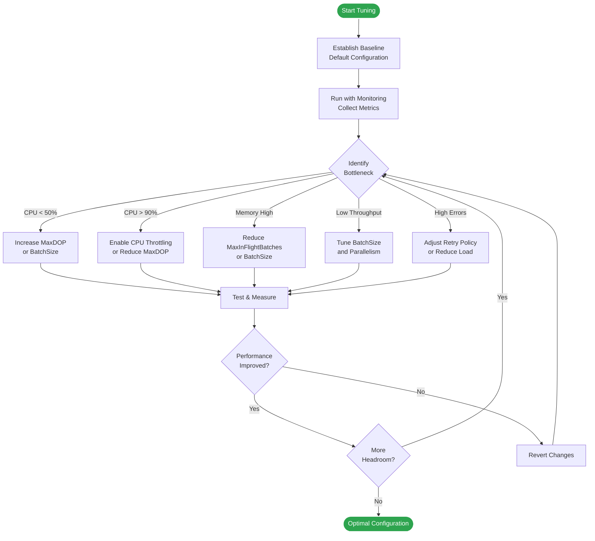

# Performance Tuning Guide

This guide provides comprehensive information on optimizing Tika.BatchIngestor for maximum throughput and efficiency.

## Table of Contents

- [Quick Start Configurations](#quick-start-configurations)
- [Understanding the Configuration Parameters](#understanding-the-configuration-parameters)
- [Tuning Methodology](#tuning-methodology)
- [Scenario-Based Tuning](#scenario-based-tuning)
- [CPU and Memory Optimization](#cpu-and-memory-optimization)
- [Database-Specific Optimizations](#database-specific-optimizations)
- [Network Considerations](#network-considerations)
- [Benchmarking and Measurement](#benchmarking-and-measurement)
- [Troubleshooting Performance Issues](#troubleshooting-performance-issues)

## Quick Start Configurations

### Recommended Configurations by Scenario

| Scenario | BatchSize | MaxDOP | MaxInFlight | MaxCPU% | Expected Throughput |
|----------|-----------|--------|-------------|---------|-------------------|
| **IoT Sensors** (small, ~100 bytes) | 5000-10000 | 6-8 | 15-20 | 80-85% | 10,000-15,000 rows/sec |
| **Vehicle Telemetry** (medium, ~500 bytes) | 2000-5000 | 4-6 | 10-15 | 75-80% | 7,000-12,000 rows/sec |
| **Time-Series Metrics** (minimal, ~64 bytes) | 8000-15000 | 8 | 20 | 85% | 12,000-18,000 rows/sec |
| **Industrial Logs** (large, ~2KB) | 500-1000 | 2-4 | 5-10 | 70-75% | 3,000-6,000 rows/sec |
| **Local Database** | 2000-5000 | 4-8 | 10-20 | 80% | 8,000-12,000 rows/sec |
| **Remote Database** | 1000-2000 | 2-4 | 5-10 | 75% | 5,000-8,000 rows/sec |
| **Cloud RDS** (Aurora/Azure) | 1500-3000 | 4-6 | 10-15 | 80% | 6,000-10,000 rows/sec |

### Example: IoT Sensor Data Configuration

```csharp
var options = new BatchIngestOptions
{
    // Batch Configuration
    BatchSize = 5000,              // Large batches for small records
    MaxDegreeOfParallelism = 8,    // High parallelism for throughput
    MaxInFlightBatches = 20,       // More batches in pipeline

    // Transaction Settings
    UseTransactions = true,
    TransactionPerBatch = true,    // Separate transaction per batch

    // CPU Throttling
    EnableCpuThrottling = true,
    MaxCpuPercent = 85.0,          // Allow higher CPU for IoT
    ThrottleDelayMs = 100,

    // Performance Monitoring
    EnablePerformanceMetrics = true,
    PerformanceMetricsIntervalMs = 1000,

    // Timeouts
    CommandTimeoutSeconds = 300,

    // Retry Policy
    RetryPolicy = new RetryPolicy
    {
        MaxRetries = 3,
        InitialDelayMs = 100,
        MaxDelayMs = 5000,
        UseExponentialBackoff = true,
        UseJitter = true
    },

    // Progress Monitoring
    OnProgress = metrics =>
    {
        Console.WriteLine(
            $"Progress: {metrics.TotalRowsProcessed:N0} rows, " +
            $"{metrics.RowsPerSecond:N0} rows/sec, " +
            $"CPU: {metrics.CurrentPerformance?.CpuUsagePercent:F2}%");
    }
};
```

## Understanding the Configuration Parameters

### BatchSize

**What it does**: Number of rows grouped together for a single INSERT operation.

**Impact**:
- **Larger batches** → Fewer database round trips, higher throughput
- **Smaller batches** → Lower latency, faster failure detection, less memory

**Formula**:
```
Optimal BatchSize = min(
    MaxParametersPerCommand / ColumnCount,
    MaxMemory / (AvgRowSize × MaxInFlightBatches)
)
```

**Guidelines**:
- **Small rows (<100 bytes)**: 5,000-10,000
- **Medium rows (100-500 bytes)**: 1,000-5,000
- **Large rows (>500 bytes)**: 500-2,000
- **SQL Server limit**: 2,100 parameters / column count
- **PostgreSQL/MySQL**: Higher limits (32,767)

**Example**:
```csharp
// SQL Server with 10 columns: max batch = 2100 / 10 = 210 rows
// But for performance, use larger batches (1000-2000)
BatchSize = 1000
```

### MaxDegreeOfParallelism (MaxDOP)

**What it does**: Number of concurrent consumer tasks processing batches.

**Impact**:
- **Higher MaxDOP** → More concurrent operations, higher throughput
- **Lower MaxDOP** → Less resource contention, more stable

**Guidelines**:
- **CPU-bound** (local database): `Environment.ProcessorCount`
- **IO-bound** (network database): `2-4 × Environment.ProcessorCount`
- **High latency network**: Up to `8-16` for better throughput
- **Resource-constrained**: Start with `2-4`

**Formula**:
```
MaxDOP = min(
    AvailableCores × TargetUtilization,
    DatabaseConnectionPoolSize / 2
)
```

**Example**:
```csharp
// 8-core machine, 50% CPU target
MaxDegreeOfParallelism = 4

// Remote database with high latency
MaxDegreeOfParallelism = 8  // More parallelism for IO-bound
```

### MaxInFlightBatches

**What it does**: Bounded channel capacity controlling how many batches can be queued.

**Impact**:
- **Higher limit** → More buffering, smoother throughput, higher memory
- **Lower limit** → Less memory, more backpressure, potential producer stalls

**Memory Formula**:
```
Memory Usage ≈ MaxInFlightBatches × BatchSize × AvgRowSize
```

**Guidelines**:
- Start with `10` (default)
- Increase if producer is faster than consumers
- Decrease if memory is constrained
- Typical range: `5-20`

**Example**:
```csharp
// Memory calculation
// MaxInFlightBatches = 20
// BatchSize = 5000
// AvgRowSize = 100 bytes
// Memory ≈ 20 × 5000 × 100 = ~10 MB

MaxInFlightBatches = 20
```

### CPU Throttling

**What it does**: Monitors CPU usage and delays processing when threshold exceeded.

**Parameters**:
- `EnableCpuThrottling`: Enable/disable feature
- `MaxCpuPercent`: CPU threshold (0-100)
- `ThrottleDelayMs`: Delay duration when throttling

**Guidelines**:
- **Background jobs**: 70-80% (leave headroom for other processes)
- **Dedicated workers**: 85-90% (maximize throughput)
- **Shared environments**: 60-70% (be conservative)
- **Disable**: Set `MaxCpuPercent = 0` or `EnableCpuThrottling = false`

**Example**:
```csharp
// Conservative throttling for shared server
EnableCpuThrottling = true,
MaxCpuPercent = 70.0,
ThrottleDelayMs = 200  // Longer delay for more aggressive throttling
```

### Transaction Configuration

**UseTransactions**: Enable database transactions.

**TransactionPerBatch**:
- `true`: Each batch gets its own transaction (recommended)
- `false`: Single transaction for entire ingestion

**Guidelines**:
- **Always use `TransactionPerBatch = true`** for large ingests
- Single transaction can cause huge transaction logs
- Batch-level transactions allow partial success
- Better error recovery and retry behavior

**Example**:
```csharp
UseTransactions = true,
TransactionPerBatch = true  // Recommended for production
```

## Tuning Methodology

### Step-by-Step Tuning Process



### Baseline Configuration

Start with conservative defaults:

```csharp
var baselineOptions = new BatchIngestOptions
{
    BatchSize = 1000,
    MaxDegreeOfParallelism = 4,
    MaxInFlightBatches = 10,
    EnableCpuThrottling = true,
    MaxCpuPercent = 80.0,
    EnablePerformanceMetrics = true
};
```

### Monitoring Metrics

```csharp
var options = new BatchIngestOptions
{
    // ... configuration ...

    OnProgress = metrics =>
    {
        // Key metrics to monitor
        Console.WriteLine($"Throughput: {metrics.RowsPerSecond:N0} rows/sec");
        Console.WriteLine($"Total Rows: {metrics.TotalRowsProcessed:N0}");
        Console.WriteLine($"Batches: {metrics.BatchesCompleted}");
        Console.WriteLine($"Errors: {metrics.ErrorCount}");
        Console.WriteLine($"Avg Batch Duration: {metrics.AverageBatchDuration.TotalMilliseconds:N2}ms");

        if (metrics.CurrentPerformance != null)
        {
            var perf = metrics.CurrentPerformance;
            Console.WriteLine($"CPU: {perf.CpuUsagePercent:F2}%");
            Console.WriteLine($"Memory: {perf.WorkingSetMB:F2} MB");
            Console.WriteLine($"GC Gen0: {perf.Gen0Collections}");
            Console.WriteLine($"GC Gen2: {perf.Gen2Collections}");
        }
    }
};
```

### Iterative Tuning

1. **Identify Bottleneck**:
   - CPU < 50% → Not using available resources
   - CPU > 90% → Overloading system
   - High memory → Too much buffering
   - Low throughput → Suboptimal batching

2. **Make ONE Change at a Time**:
   - Adjust single parameter
   - Run benchmark
   - Compare metrics
   - Keep or revert

3. **Test Under Load**:
   - Use representative data
   - Test with expected volume
   - Monitor for sustained period
   - Check for memory leaks

## Scenario-Based Tuning

### Scenario 1: Maximum Throughput (Dedicated Server)

**Goal**: Achieve highest possible throughput on dedicated hardware.

```csharp
var options = new BatchIngestOptions
{
    BatchSize = 10000,             // Large batches
    MaxDegreeOfParallelism = 8,    // High concurrency
    MaxInFlightBatches = 20,       // More buffering
    EnableCpuThrottling = true,
    MaxCpuPercent = 90.0,          // Allow high CPU
    ThrottleDelayMs = 50,          // Short delays
    CommandTimeoutSeconds = 600,   // Longer timeout for large batches
    UseTransactions = true,
    TransactionPerBatch = true
};
```

**Expected**: 12,000-18,000 rows/sec on modern hardware

### Scenario 2: Shared Environment (CPU Limited)

**Goal**: Ingest data without impacting other applications.

```csharp
var options = new BatchIngestOptions
{
    BatchSize = 2000,              // Moderate batches
    MaxDegreeOfParallelism = 2,    // Low concurrency
    MaxInFlightBatches = 5,        // Limited buffering
    EnableCpuThrottling = true,
    MaxCpuPercent = 60.0,          // Conservative limit
    ThrottleDelayMs = 200,         // Longer delays
    CommandTimeoutSeconds = 300,
    UseTransactions = true,
    TransactionPerBatch = true
};
```

**Expected**: 3,000-5,000 rows/sec with low CPU impact

### Scenario 3: Memory Constrained (< 512 MB Available)

**Goal**: Minimize memory footprint while maintaining reasonable throughput.

```csharp
var options = new BatchIngestOptions
{
    BatchSize = 500,               // Small batches
    MaxDegreeOfParallelism = 2,    // Low concurrency
    MaxInFlightBatches = 5,        // Minimal buffering
    EnableCpuThrottling = false,   // No additional overhead
    EnablePerformanceMetrics = false,  // Reduce overhead
    CommandTimeoutSeconds = 300,
    UseTransactions = true,
    TransactionPerBatch = true
};
```

**Expected**: 2,000-4,000 rows/sec with ~50 MB memory

### Scenario 4: Remote Database (High Latency)

**Goal**: Compensate for network latency with parallelism.

```csharp
var options = new BatchIngestOptions
{
    BatchSize = 2000,              // Larger batches reduce round trips
    MaxDegreeOfParallelism = 8,    // High parallelism for IO-bound
    MaxInFlightBatches = 15,       // More pipeline depth
    EnableCpuThrottling = true,
    MaxCpuPercent = 75.0,
    CommandTimeoutSeconds = 600,   // Longer timeout for network
    RetryPolicy = new RetryPolicy
    {
        MaxRetries = 5,            // More retries for network issues
        InitialDelayMs = 200,
        MaxDelayMs = 10000,
        UseExponentialBackoff = true,
        UseJitter = true
    }
};
```

**Expected**: 5,000-8,000 rows/sec depending on latency

### Scenario 5: Real-Time Streaming (Low Latency)

**Goal**: Process data with minimal latency for real-time systems.

```csharp
var options = new BatchIngestOptions
{
    BatchSize = 100,               // Small batches for low latency
    MaxDegreeOfParallelism = 4,
    MaxInFlightBatches = 3,        // Minimal buffering
    EnableCpuThrottling = true,
    MaxCpuPercent = 80.0,
    TransactionPerBatch = true,    // Quick commits

    OnBatchCompleted = (batchNum, duration) =>
    {
        // Monitor latency
        Console.WriteLine($"Batch {batchNum} latency: {duration.TotalMilliseconds}ms");
    }
};
```

**Expected**: 1,000-3,000 rows/sec with <100ms latency per batch

## CPU and Memory Optimization

### CPU Optimization

#### Understanding CPU Usage Patterns

```csharp
// Monitor CPU usage
var options = new BatchIngestOptions
{
    EnablePerformanceMetrics = true,
    PerformanceMetricsIntervalMs = 500,  // Frequent sampling

    OnProgress = metrics =>
    {
        var cpu = metrics.CurrentPerformance?.CpuUsagePercent ?? 0;

        if (cpu < 40)
        {
            Console.WriteLine("⚠️ CPU underutilized - Consider increasing MaxDOP or BatchSize");
        }
        else if (cpu > 85)
        {
            Console.WriteLine("⚠️ CPU overloaded - Consider reducing MaxDOP or enabling throttling");
        }
        else
        {
            Console.WriteLine($"✓ CPU well utilized: {cpu:F2}%");
        }
    }
};
```

#### CPU Throttling Strategies

**Adaptive Throttling** (future enhancement):
```csharp
// Current: Fixed threshold
MaxCpuPercent = 80.0

// Future: Adaptive based on time of day, system load, etc.
```

**Custom Throttling Logic**:
```csharp
var options = new BatchIngestOptions
{
    EnableCpuThrottling = false,  // Disable built-in

    OnBatchCompleted = async (batchNum, duration) =>
    {
        // Custom throttling logic
        var cpuUsage = GetCurrentCpuUsage();
        if (cpuUsage > 80)
        {
            await Task.Delay(CalculateThrottleDelay(cpuUsage));
        }
    }
};
```

### Memory Optimization

#### Memory Usage Calculation

```
Total Memory = MaxInFlightBatches × BatchSize × AvgRowSize + Overhead

Where:
- Overhead ≈ 10-20% for .NET runtime, metrics, etc.
```

#### Examples:

**High Memory Scenario:**
```
MaxInFlightBatches = 20
BatchSize = 5000
AvgRowSize = 200 bytes
Memory = 20 × 5000 × 200 + 20% ≈ 24 MB
```

**Low Memory Scenario:**
```
MaxInFlightBatches = 5
BatchSize = 500
AvgRowSize = 200 bytes
Memory = 5 × 500 × 200 + 20% ≈ 600 KB
```

#### Monitoring Memory

```csharp
var options = new BatchIngestOptions
{
    EnablePerformanceMetrics = true,

    OnProgress = metrics =>
    {
        var perf = metrics.PeakPerformance;
        if (perf != null)
        {
            Console.WriteLine($"Current Memory: {metrics.CurrentPerformance?.WorkingSetMB:F2} MB");
            Console.WriteLine($"Peak Memory: {perf.PeakWorkingSetMB:F2} MB");
            Console.WriteLine($"GC Gen2: {perf.Gen2Collections}");

            // Warning if Gen2 collections are frequent
            if (perf.Gen2Collections > 10)
            {
                Console.WriteLine("⚠️ Frequent Gen2 GC - Consider reducing batch size or in-flight batches");
            }
        }
    }
};
```

#### Memory-Efficient Configuration

```csharp
var options = new BatchIngestOptions
{
    BatchSize = 500,               // Smaller batches
    MaxInFlightBatches = 5,        // Less buffering
    EnablePerformanceMetrics = false,  // Disable if not needed

    // Process in smaller chunks
    OnProgress = null              // Disable if callbacks allocate memory
};
```

## Database-Specific Optimizations

### SQL Server / Azure SQL

**Optimal Configuration:**
```csharp
var options = new BatchIngestOptions
{
    BatchSize = 2000,              // SQL Server performs well here
    MaxDegreeOfParallelism = 4,
    MaxInFlightBatches = 10,
    CommandTimeoutSeconds = 300,
    UseTransactions = true,
    TransactionPerBatch = true
};

var dialect = new SqlServerDialect();  // or AzureSqlDialect for Azure
```

**Tips:**
- SQL Server has 2,100 parameter limit: `BatchSize = 2100 / ColumnCount`
- Use `SqlServerDialect` for on-premise
- Use `AzureSqlDialect` for Azure SQL (includes cloud optimizations)
- Consider indexes on target table
- Disable indexes during bulk load if possible

**Advanced: SqlBulkCopy Strategy** (future):
```csharp
// For maximum SQL Server performance
var strategy = new SqlBulkCopyStrategy<MyData>();
```

### PostgreSQL / Amazon Aurora PostgreSQL

**Optimal Configuration:**
```csharp
var options = new BatchIngestOptions
{
    BatchSize = 5000,              // PostgreSQL handles large batches well
    MaxDegreeOfParallelism = 6,
    MaxInFlightBatches = 15,
    CommandTimeoutSeconds = 600
};

var dialect = new AuroraPostgreSqlDialect();  // Or GenericSqlDialect
```

**Tips:**
- PostgreSQL has 32,767 parameter limit (very high)
- Use larger batch sizes (5,000-10,000)
- Consider `UNLOGGED` tables for staging
- Use `COPY` command for absolute maximum performance (custom strategy)

**Advanced: COPY Strategy** (future):
```csharp
// PostgreSQL COPY is fastest
var strategy = new PostgreSqlCopyStrategy<MyData>();
```

### MySQL / Amazon Aurora MySQL

**Optimal Configuration:**
```csharp
var options = new BatchIngestOptions
{
    BatchSize = 3000,              // MySQL sweet spot
    MaxDegreeOfParallelism = 4,
    MaxInFlightBatches = 12,
    CommandTimeoutSeconds = 300
};

var dialect = new AuroraMySqlDialect();  // Or GenericSqlDialect for standard MySQL
```

**Tips:**
- Use `AuroraMySqlDialect` for Aurora MySQL
- Consider `max_allowed_packet` server setting
- Use `INSERT IGNORE` or `ON DUPLICATE KEY UPDATE` for idempotency
- InnoDB performs better with smaller batches than MyISAM

### SQLite

**Optimal Configuration:**
```csharp
var options = new BatchIngestOptions
{
    BatchSize = 5000,              // SQLite can handle large batches
    MaxDegreeOfParallelism = 1,    // SQLite writer lock: only 1 writer
    MaxInFlightBatches = 1,        // No point in queueing
    UseTransactions = true,
    TransactionPerBatch = false,   // Single transaction is fine for SQLite
    EnableCpuThrottling = false    // Usually fast enough
};

var dialect = new GenericSqlDialect();
```

**Tips:**
- SQLite has writer serialization: MaxDOP must be 1
- Use single transaction for best performance
- Consider `PRAGMA synchronous = OFF` for maximum speed (at data loss risk)
- Great for development and testing

## Network Considerations

### Low Latency Network (<1ms)

**Configuration:**
```csharp
var options = new BatchIngestOptions
{
    BatchSize = 2000,
    MaxDegreeOfParallelism = 4,
    MaxInFlightBatches = 10
};
```

**Expected**: 8,000-12,000 rows/sec

### Medium Latency Network (1-10ms)

**Configuration:**
```csharp
var options = new BatchIngestOptions
{
    BatchSize = 3000,              // Larger batches reduce round trips
    MaxDegreeOfParallelism = 6,    // More parallelism
    MaxInFlightBatches = 15
};
```

**Expected**: 6,000-10,000 rows/sec

### High Latency Network (>10ms, Cross-Region)

**Configuration:**
```csharp
var options = new BatchIngestOptions
{
    BatchSize = 5000,              // Large batches critical
    MaxDegreeOfParallelism = 8,    // High parallelism to hide latency
    MaxInFlightBatches = 20,
    CommandTimeoutSeconds = 600,   // Longer timeout
    RetryPolicy = new RetryPolicy
    {
        MaxRetries = 5,
        InitialDelayMs = 500,
        MaxDelayMs = 15000
    }
};
```

**Expected**: 3,000-6,000 rows/sec (heavily depends on latency)

## Benchmarking and Measurement

### Running Benchmarks

```bash
cd benchmarks/Tika.BatchIngestor.Benchmarks
dotnet run -c Release

# Output includes:
# - Throughput (rows/sec)
# - Latency percentiles (p50, p95, p99)
# - CPU and memory usage
# - Error rates
```

### Custom Benchmark

```csharp
using System.Diagnostics;

// Prepare test data
var testData = GenerateTestData(100_000);

// Configure
var options = new BatchIngestOptions
{
    BatchSize = 2000,
    MaxDegreeOfParallelism = 4,
    MaxInFlightBatches = 10,
    EnablePerformanceMetrics = true
};

// Run
var stopwatch = Stopwatch.StartNew();
var metrics = await ingestor.IngestAsync(testData, "TestTable");
stopwatch.Stop();

// Report
Console.WriteLine($"Total Time: {stopwatch.Elapsed}");
Console.WriteLine($"Throughput: {metrics.RowsPerSecond:N0} rows/sec");
Console.WriteLine($"Peak CPU: {metrics.PeakPerformance?.CpuUsagePercent:F2}%");
Console.WriteLine($"Peak Memory: {metrics.PeakPerformance?.PeakWorkingSetMB:F2} MB");
Console.WriteLine($"Errors: {metrics.ErrorCount}");
```

### Metrics to Track

**Throughput Metrics:**
- Rows per second
- Batches per second
- Average batch duration

**Resource Metrics:**
- CPU usage (average and peak)
- Memory usage (working set and private bytes)
- GC collections (especially Gen2)
- Thread count

**Reliability Metrics:**
- Error count and error rate
- Retry attempts
- Transaction rollbacks

## Troubleshooting Performance Issues

### Issue: Low Throughput (<1000 rows/sec)

**Possible Causes:**
1. Batch size too small
2. MaxDOP too low
3. CPU throttling too aggressive
4. Database is bottleneck

**Solutions:**
```csharp
// Try this configuration
BatchSize = 5000,               // Increase
MaxDegreeOfParallelism = 6,     // Increase
MaxCpuPercent = 85.0,           // Increase or disable
EnableCpuThrottling = false     // Try disabling
```

### Issue: High CPU Usage (>95%)

**Possible Causes:**
1. MaxDOP too high
2. CPU throttling disabled
3. Insufficient throttle delay

**Solutions:**
```csharp
MaxDegreeOfParallelism = 2,     // Reduce
EnableCpuThrottling = true,
MaxCpuPercent = 70.0,           // Lower threshold
ThrottleDelayMs = 200           // Longer delay
```

### Issue: High Memory Usage

**Possible Causes:**
1. MaxInFlightBatches too high
2. BatchSize too large
3. Memory leak (rare)

**Solutions:**
```csharp
MaxInFlightBatches = 5,         // Reduce
BatchSize = 1000,               // Reduce
// Monitor GC collections
```

### Issue: Frequent Errors

**Possible Causes:**
1. Database timeout
2. Network issues
3. Database constraints violated
4. Insufficient retry policy

**Solutions:**
```csharp
CommandTimeoutSeconds = 600,    // Increase timeout
RetryPolicy = new RetryPolicy
{
    MaxRetries = 5,             // More retries
    InitialDelayMs = 500,
    MaxDelayMs = 15000,
    UseExponentialBackoff = true,
    UseJitter = true
}
```

### Issue: Inconsistent Performance

**Possible Causes:**
1. GC pauses (Gen2 collections)
2. CPU throttling activating
3. Network variance
4. Database locks/contention

**Solutions:**
```csharp
// Reduce GC pressure
MaxInFlightBatches = 10,
EnablePerformanceMetrics = false,

// More consistent CPU
EnableCpuThrottling = true,
MaxCpuPercent = 75.0
```

## Performance Checklist

- [ ] Measure baseline performance with default config
- [ ] Identify bottleneck (CPU, memory, network, database)
- [ ] Tune ONE parameter at a time
- [ ] Test with representative data volume
- [ ] Monitor metrics during sustained operation
- [ ] Verify no memory leaks (check Gen2 GC collections)
- [ ] Test error scenarios and retry behavior
- [ ] Document final configuration
- [ ] Run benchmarks to validate improvements
- [ ] Set up health check monitoring for production

## Advanced Topics

### Adaptive Batch Sizing (Future)

Future enhancement to automatically adjust batch size based on performance:

```csharp
// Future feature
var options = new BatchIngestOptions
{
    EnableAdaptiveBatchSizing = true,
    MinBatchSize = 500,
    MaxBatchSize = 10000,
    TargetLatency = TimeSpan.FromMilliseconds(500)
};
```

### Connection Pool Tuning

Ensure database connection pool is sized appropriately:

```csharp
// Connection string tuning
var connectionString =
    "Server=...;Database=...;" +
    "Min Pool Size=4;" +              // Min connections
    "Max Pool Size=20;" +             // Should be >= MaxDOP
    "Connection Lifetime=300;" +      // Recycle connections
    "Connection Timeout=30";          // Connection timeout
```

### Table Design Considerations

**Optimal table design for ingestion:**
- Minimize indexes during bulk load (add after if needed)
- Use appropriate column types (avoid VARCHAR(MAX) if possible)
- Consider partitioning for very large tables
- Heap tables are faster for inserts (but slower for reads)

## Summary

**Golden Rules:**
1. Start with conservative defaults
2. Measure before and after each change
3. Tune for your specific workload
4. Monitor in production
5. Document your final configuration

**Most Important Parameters:**
- `BatchSize`: Biggest impact on throughput
- `MaxDegreeOfParallelism`: Controls concurrency
- `MaxInFlightBatches`: Controls memory usage
- `MaxCpuPercent`: Controls CPU impact

**Typical Production Configuration:**
```csharp
var options = new BatchIngestOptions
{
    BatchSize = 2000,
    MaxDegreeOfParallelism = 4,
    MaxInFlightBatches = 10,
    EnableCpuThrottling = true,
    MaxCpuPercent = 80.0,
    UseTransactions = true,
    TransactionPerBatch = true,
    EnablePerformanceMetrics = true,
    RetryPolicy = new RetryPolicy
    {
        MaxRetries = 3,
        InitialDelayMs = 100,
        MaxDelayMs = 5000,
        UseExponentialBackoff = true,
        UseJitter = true
    }
};
```

## References

- [Architecture Overview](architecture.md)
- [Cloud Deployment Guide](cloud-deployment.md)
- [Troubleshooting](troubleshooting.md)
